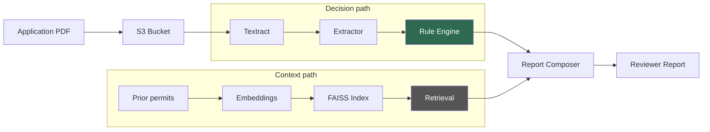
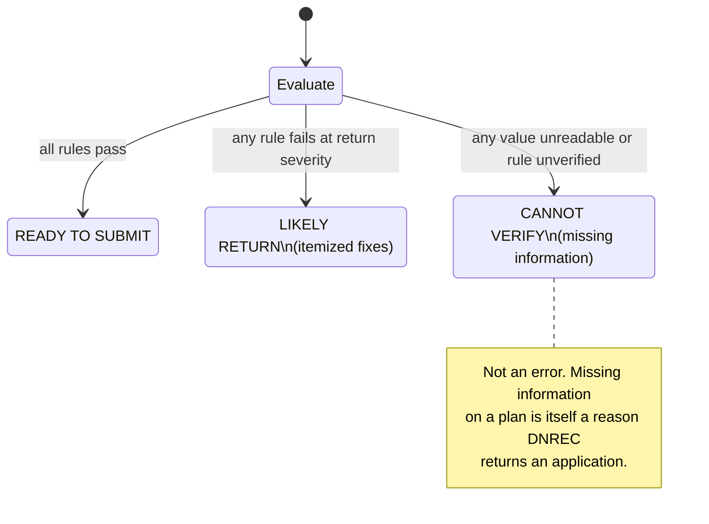

# dnrec-septic-precheck

Pre-submission review tool for Delaware septic permit applications.


## The problem

DNREC's septic permit database holds 117,802 records across 112,613 unique permits. Of those, roughly 253 were ever denied or returned for correction. DNREC rarely denies outright: it returns applications so the applicant can fix deficiencies, then accepts the resubmission. Each return costs weeks of round-trip time. This tool catches the deficiencies before submission.

## What this tool does not do

It is not an approve/reject classifier. With 253 negative examples in 112,613 permits, training a classifier is not viable and has not been attempted. The tool does not decide anything: rules extracted from the regulation produce the verdict, and retrieved prior cases supply context only. A threshold is never shown to the user unless a human has verified it against the cited page in the regulation PDF.

## Architecture



The rule engine is the decision path. It evaluates each requirement from the regulation against facts extracted from the application and returns PASS, FAIL, or UNKNOWN with a citation. Retrieval finds similar prior permits with their outcomes, but that information only appears as supporting context in the report. A retrieved permit being approved is not evidence that a new application complies.

## Three outcomes



CANNOT VERIFY is a real product state, not an error condition. A scanned site plan where the setback distance is illegible, a form field left blank, or a rule whose threshold has not been verified against the regulation all produce this outcome. Missing information on a plan is itself a reason an application gets returned, so reporting it honestly is correct.

## Data provenance

| Item | Source | Notes |
| --- | --- | --- |
| Permit CSV | data.delaware.gov (Socrata dataset mv7j-tx3u) | 117,802 rows, exported 2026-08-17. Not tracked (45 MB). |
| Regulation PDF | Given by a DNREC mentor | "Delaware On-Site Septic System Regulations with Exhibits", January 11, 2014 edition. 245 pages. Tracked. |
| Scope | 2014 onward | Permits from 2014 forward fall under the current regulation. Earlier permits fall under superseded law, so a finding against them would cite a rule that no longer applies. |
| Harvested corpus | 143 PDFs in S3 | Denied and Application Returned permits, all years. 401.9 MB. |

## Repository layout

```
docs/
  HANDOFF.md                    project state and measured facts
  regulations/
    de-onsite-wastewater-2014.pdf   the regulation (source of truth for thresholds)
    SOURCE.md                       provenance and version history
src/septic/
  config.py                     bucket, region, profile, paths (single source of truth)
  preflight.py                  AWS capability checks
  cli.py                        entry point with subcommands
  harvest/                      scraping permits and documents into S3
  ingest/                       Textract job submission and block parsing
  rules/                        rule schema, engine, YAML rule set, candidates
  retrieval/                    similarity search over prior permits (stub)
  report/                       report composition and rendering (stub)
scripts/                        thin runnable wrappers, no business logic
tests/                          72 tests covering parsing, rules, and layout
out/                            run artifacts (gitignored)
```

## Quickstart

Prerequisites: Python 3.11, an AWS account with S3, Textract, and Bedrock access, and the `dnrec` profile configured per `docs/HANDOFF.md`.

```bash
pip install -r requirements.txt
```

Verify AWS access (takes about 60 seconds, most of it waiting on Textract):

```bash
python -m septic preflight
```

Extract rule candidates from the regulation:

```bash
python -m septic candidates
```

Evaluate the shipped (unverified) rules against an empty fact set:

```bash
python -m septic rules
```

Run the harvester for the denied and returned slice:

```bash
python -m septic harvest --status Denied "Application Returned"
```

Reconcile the manifest against S3:

```bash
python -m septic audit
```

Recheck permits recorded with zero documents (rate limited, 1 request per second):

```bash
python -m septic verify --limit 15
```

## Current status

- [x] S3 bucket provisioned, hardened, and 143 PDFs harvested
- [x] Document classification from URL markers (0% Other, 100% parcel fill)
- [x] Textract submission, polling, caching, and block parsing
- [x] Rule schema with three-valued evaluation (PASS / FAIL / UNKNOWN)
- [x] Regulation candidate extractor (644 passages across 389 sections)
- [x] Bedrock text generation working (Opus 4.6 via inference profile)
- [x] Bedrock embeddings working (Titan v2, 1024 dimensions)
- [x] Preflight checks all passing (8/8)
- [ ] No regulation threshold has been human-verified yet
- [ ] Fact extractor (Textract output to rule parameters) not built
- [ ] Retrieval module not implemented
- [ ] Report composer not implemented
- [ ] Permit Events grid not parsed (the actual return signal)
- [ ] 134 zero-document permits not yet rechecked
