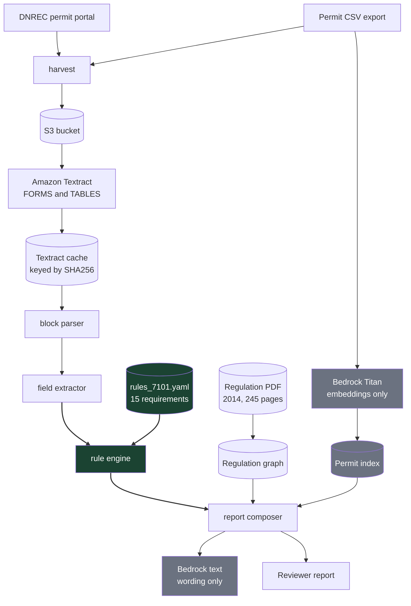

# dnrec-septic-precheck

[](https://github.com/NSF-DARSE/dnrec-septic-precheck/actions/workflows/ci.yml)
[](https://www.python.org/downloads/release/python-3110/)
[](docs/evidence/preflight.txt)
[](docs/coverage.md)

A first pass over a septic permit application that flags deficiencies and puts the
regulation citation next to each one.

## The problem

A DNREC reviewer gets a packet and checks it by hand against a 245 page
regulation. Most packets come back for correction, and each correction means
reading the whole packet again from the start. Because the checking is manual, two
reviewers can read the same requirement differently. The slow part is not the
decision, it is finding the handful of things that are wrong.

## What it does not do

It does not approve or deny anything. It does not predict what DNREC will decide.
When it cannot confirm a rule against the regulation, it says so and gives no
answer. The reviewer decides.

## The pipeline



<details>
<summary>Diagram source</summary>

The image above is rendered from this definition and committed, so the figure
does not depend on a diagram renderer running in the reader's browser.



</details>

The green boxes decide. Everything grey is context or wording and cannot change a
finding. No model is ever asked whether an application complies.

Every stage above runs today. One correction: the vector index is a JSON file
scored with a dot product, not FAISS, because 1460 permits fit in memory many times
over. Not built, and not shown, is the Permit Events grid, which is where a return
is actually recorded.

## The three outcomes

**NO DEFICIENCIES FOUND.** Nothing was flagged among the checks that ran. This is
not an approval.

**DEFICIENCIES FOUND.** One or more requirements are not met, each itemised with
the section and page it comes from.

**CANNOT VERIFY.** No answer. Either a value could not be read off the packet, or
the rule needed has not been confirmed by a person.

## Why CANNOT VERIFY exists

Showing a reviewer a wrong setback distance is worse than showing nothing, because
a wrong number that looks official gets passed to an applicant. So a rule counts
only once a person has read the cited page and confirmed it.

## Data provenance

**Permit CSV.** data.delaware.gov, dataset mv7j-tx3u, exported 2026-08-17. 117,802
rows, 112,643 unique detail pages, 112,613 permits. 45 MB, gitignored.

**Regulation PDF.** Delaware Regulations Governing On-Site Wastewater Treatment and
Disposal Systems, January 11, 2014. 245 pages. Tracked here, because every
threshold has to be traceable to it.

**Scope and harvest.** 2014 onward, because earlier permits fall under superseded
law and a finding against them would cite a rule that no longer applies. 1226
approved permits from 2014 onward, of which only 218 carry any document. The other
1008 expose nothing but their CSV row. Separately, 234 denied and returned permits
across all years.

**Refusals are rare and undocumented.** 147 permits were ever denied and 87
returned. From 2014 onward that is 101 denied and 3 returned. The letters saying
why an application was returned are not published anywhere. That is why the rules
come out of the regulation rather than from past decisions: the decisions do not
record their reasons.

## Layout

```
docs/                 handoff notes, decisions, the rule review checklist
docs/coverage.md      how much of the regulation is checked, in counts
docs/evidence/        captured AWS output, so the demo does not need credentials
docs/regulations/     the 2014 regulation PDF, source of every threshold
data/gis/             Delaware FirstMap hydrography, downloaded once
src/septic/harvest/   fetching permits and documents into S3
src/septic/ingest/    Textract, block parsing, field extraction
src/septic/rules/     rule schema, engine, rule set, regulation graph
src/septic/retrieval/ embeddings and the local permit index
src/septic/report/    report composition and rendering
src/septic/geo.py     coordinate parsing, projection, distance screening
src/septic/maps.py    the figures
app.py                the reviewer console
scripts/              runnable wrappers, no business logic
tests/                the suite, run with pytest
out/                  run artifacts, gitignored
```

## Quickstart

Needs Python 3.11. AWS is needed only to harvest, to OCR a new document, or to
build the index. Reviewing a cached example needs no network.

```bash
python -m venv .venv
.venv\Scripts\activate                # Windows
source .venv/bin/activate             # macOS and Linux
pip install -r requirements.txt
pip install -e .
pytest
```

Build the regulation graph, then review a cached example offline:

```bash
python -m septic graph build
python -m septic review --pdf out/examples/permit_281364_60839580.pdf --offline
```

The reviewer console, which is what a reviewer would actually be handed:

```bash
pip install streamlit          # demo only, not a pipeline dependency
streamlit run app.py
```

It serves the cached packets with no network and no credentials. Uploading a new
PDF needs credentials to run Textract, and says so rather than hanging.

Other things that work:

```bash
python -m septic rules                       # evaluate the rule set
python -m septic graph context 5.3.12.1.3    # one section, fully resolved
python -m septic graph orphans               # requirements no rule covers yet
python -m septic preflight                   # check AWS access
python scripts/verify_rule_quotes.py         # every citation against the PDF
python scripts/rule_discrimination.py        # denied versus approved
python scripts/validate_geo.py               # coordinate parsing and distances
python scripts/make_figures.py               # maps and the comparison figure
python scripts/coverage_report.py            # regenerate docs/coverage.md
```

## Location screening

The regulation is full of isolation distances and Textract cannot measure a scanned
raster site plan. 105,801 of the CSV rows are geocoded, so distance to mapped
surface water is computed from coordinates instead, against Delaware FirstMap
hydrography committed under `data/gis`.

This is a screening prompt, never a determination. The regulation measures from the
disposal area and a geocoded point is somewhere else on the parcel, so the output
tells a reviewer what to check on the site plan. `src/septic/geo.py` records all
four reasons it cannot be a compliance answer, and no rule cites it, because no
provision of the regulation measures from an address point. A permit with no
coordinates produces no fact and so reads as CANNOT VERIFY.

## Status

All 15 rules have been read against the pages they cite and confirmed with the
DNREC subject matter expert, so the certification interlock no longer holds any of
them back. `docs/rules_review.md` records that review and `docs/coverage.md` gives
the counts.

What limits the tool now is reading the packet, not certifying the rules. A review
reports three things separately: how many checks ran, how many did not apply to the
system, and how many could not be read. Across the corpus a mean of 3.72 checks of
15 actually compare a value, because 10 of the 15 need a measurement that lives on
a scanned drawing. Permit 281364 returns NO DEFICIENCIES FOUND with 5 of 15 checks
run, which is a real answer over a real fraction of the regulation, and the report
says so on its face rather than implying the other 10 passed.

Known gaps:

- 993 of the 1000 sections that use obligation language are cited by no rule.
- 12 of the 15 rules need a measurement off a site plan, so the discrimination
  harness cannot test them from the CSV.
- No public well layer exists, so the well setback cannot be screened from
  coordinates and has to be read off the plan.
- `applies_to` cannot express the replacement exemption in Section 5.2.4.2.4.2.
- Six thresholds were read and rejected, four because PDFium drops the
  less-than-or-equal glyph in this PDF and the direction could not be read.
- The Permit Events grid is not parsed, and it is where a return is recorded.
